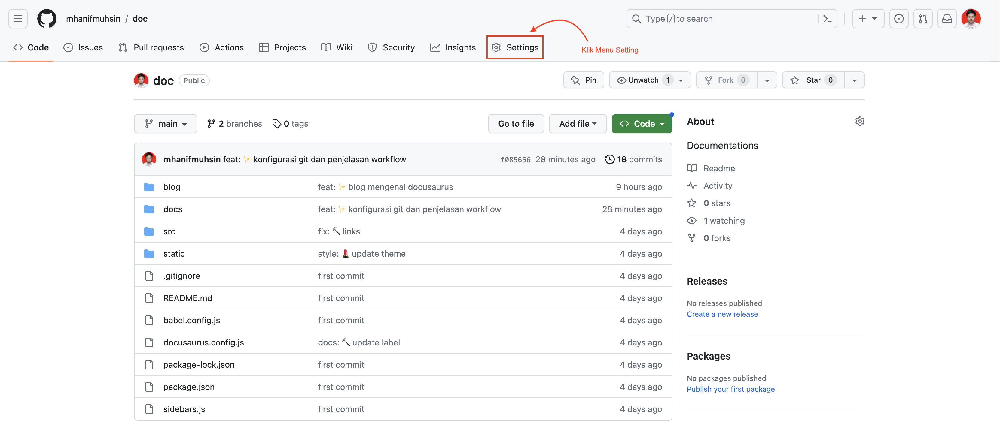
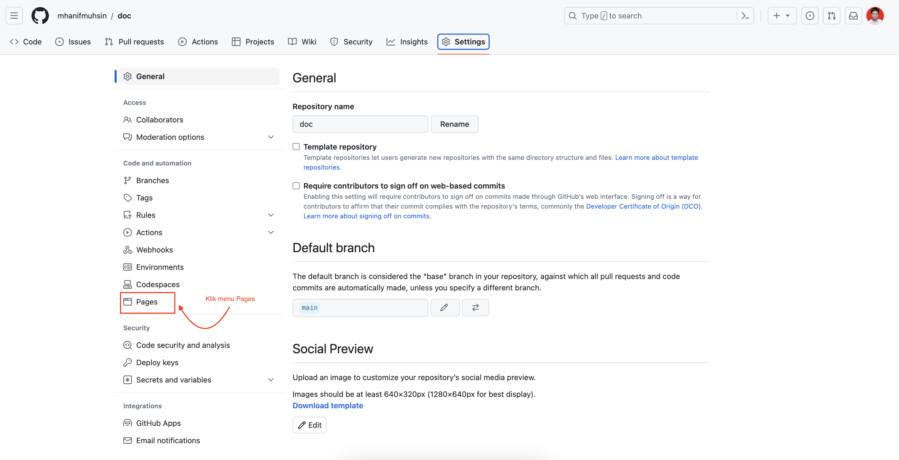
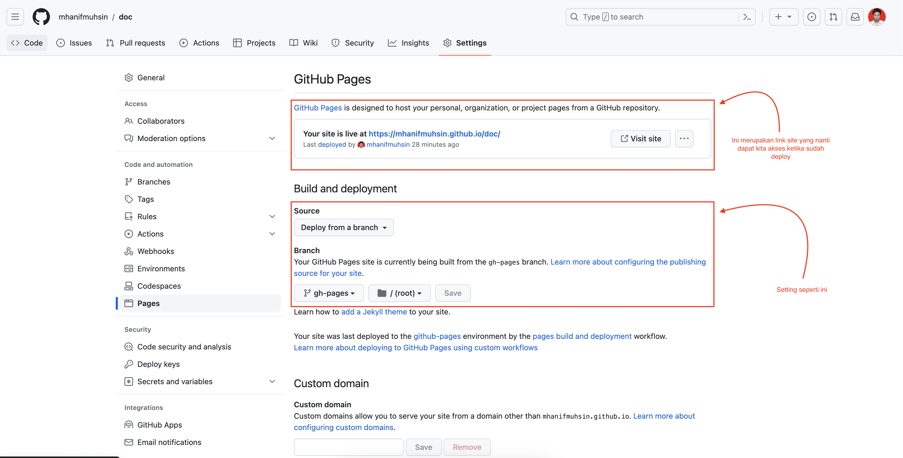
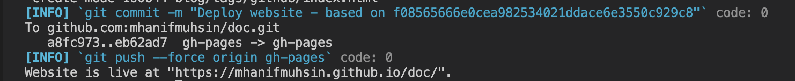

Kali ini kita akan mencoba melakukan deploy **Docusaurus** ke github pages menggunakan SSH.

Sebelum melakukan deploy ada beberapa yang harus kita siapkan atau configurasi diantaranya :

1.  Siapkan branch dengan nama gh-pages
2.  Update konfigurasi di file **docusaurus.config.js**, update dilakukan di atribut : url, baseUrl, organizationName, projectName, deploymentBranch

    ```javascript
    // Set the production url of your site here
    url: "https://mhanifmuhsin.github.io",
    // Set the /<baseUrl>/ pathname under which your site is served
    // For GitHub pages deployment, it is often '/<projectName>/'
    baseUrl: "/doc/",
    // GitHub pages deployment config.
    // If you aren't using GitHub pages, you don't need these.
    organizationName: "mhanifmuhsin", // Usually your GitHub org/user name.
    projectName: "doc", // Usually your repo name.
    deploymentBranch: "gh-pages",

    //attibute url, baseUrl, organizationName, dan projectName (Sesuaikan dengan repository masing-masing), untuk deploymentBranch isi dengan gh-pages karena branch ini yang nanti akan kita set sebagai github pages
    ```

3.  Masuk ke repository, kemudian klik Setting

    

4.  Klik menu Pages

    

5.  Setup seperti ini

    

6.  Kembali ke **Visual Studio Code**

7.  Buka terminal dan eksekusi script berikut (masih di branch main/master), dan pastikan bahwa anda mengakses repository sudah menggunakan SSH

    ```bash
    USE_SSH=true npm run deploy
    ```

8.  Jika berhasil di terminal akan muncul tapilan seperti berikut :

    

Sekian penjelasan tenang deploy docusaurus ke github pages, semoga bermanfaat.
