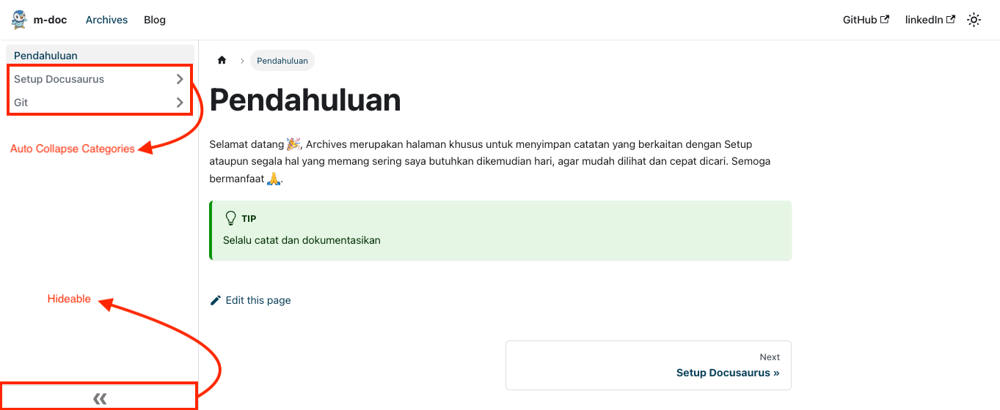

Artikel ini akan membahas konfigurasi untuk Sidebar dan Menu Kategori di Docusaurus, apa yang akan kita lakukan ?, benar kita akan mengaktifkan fitur bawaan dari docusaurus yaitu **Hideable Sidebar** dan **Auto Collapse Categories** yang berada pada Menu Doc (atau jika di blog saya berada di Menu Archive, nanti anda akan menemukan sidebar sebagai navigasi ).

Oke langsung saja berikut adalah script yang perlu kita tambahkan di file **docusaurus.config.js** :

```javascript

 themeConfig:
    /** @type {import('@docusaurus/preset-classic').ThemeConfig} */
    ({
      // start
      docs: {
        sidebar: {
          autoCollapseCategories: true,
          hideable: true,
        },
      }
    // end
    )}
```

setelah kita aktifkan maka akan muncul tanda panah dibagian bawah navigasi(sidebar) seperti ini dan jika kita membuka kategori 1 (sampel) dan kemudian kategori 2 (sampel), maka otomatis kategori 1 akan tertutup :



Sekian, semoga pemabahasan kali ini bermanfaat 🙏.
