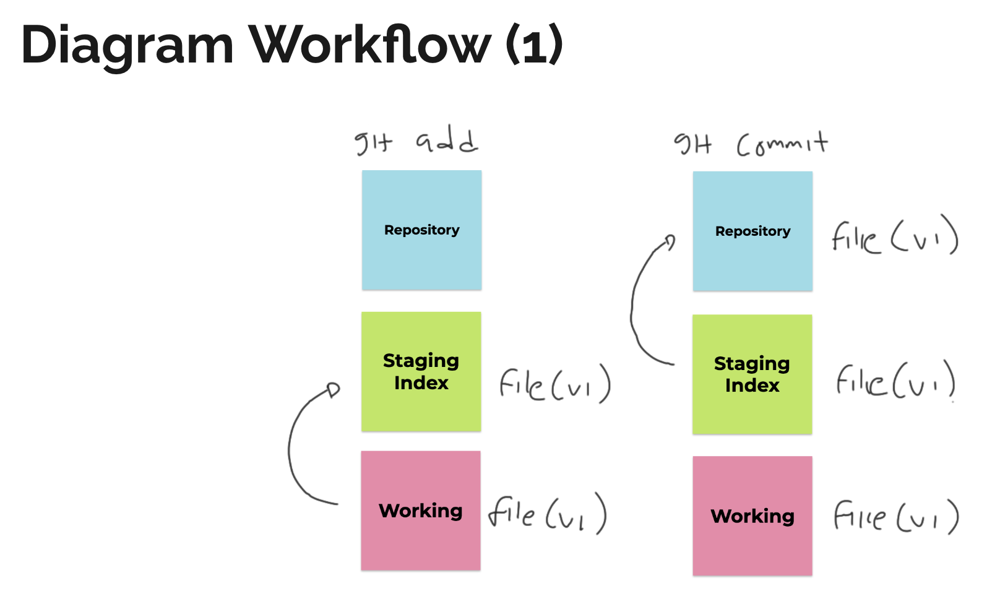
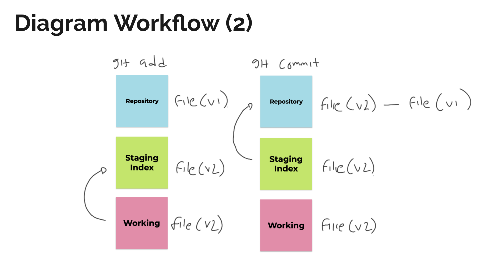

# Workflow

:::note sumber
Youtube [Programmer Zaman Now](https://www.youtube.com/watch?v=fQbTeNX1mvM&list=PL-CtdCApEFH_lYGV8hxqjtKmFA_xeLupq)
:::

## The Tree State

Git memiliki tiga state terhadap file kita, diantaranya :

1. Modified (menambah, mengedit, menghapus) file, namun belum disimpan secara permanen ke repository
2. Staged, menandai dari file yang kita modifikasi
3. Commited artinya data yang kita pilih setelah modifikasi disimpan di repository

## Three Section

Merupakan penjelasan section **The Tree State** dilakukan yang menjadi tiga section.

1. Modified dilakukan di section Working Directory
2. Pemilihan file dilakukan di section Staging Area
3. Commited dilakukan di section Repositori

## Diagram

Penjelasan diatas, dimana **git add** dilakukan ketika kita berada di **working ke staging**, sedangkan **git commit** itu untuk memindahkan dari **staging ke repository**
